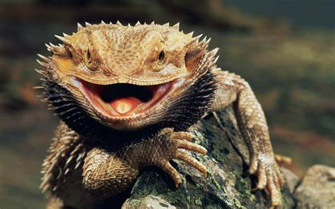
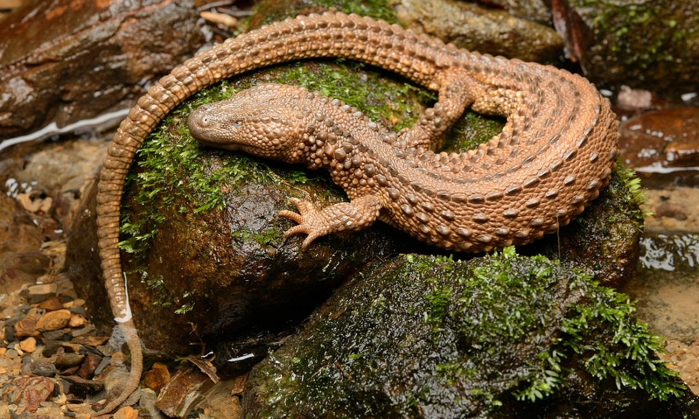
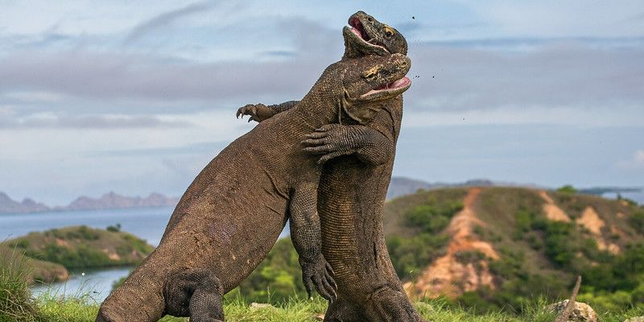

## Data Set Up

```{r libraries,echo=FALSE, message=FALSE}
library(ggplot2)
library(lme4)
library(lmerTest)
library(MuMIn)
library(GGally)
library(dplyr)
library(performance)
library(patchwork)
library(olsrr)
library(ggfortify)
options(na.action = "na.fail")
```

```{r data and cleanup}
Lizard <- read.csv("Appendix_S1.csv")
Lizard <- Lizard %>%
  select(Human_density, Surface, Elevation, EVI, Temperature, Precipitations, Connectivity, Lizard.richness)

```


## Pairs and Modeling


```{r pairs,message=FALSE}
ggpairs(Lizard, columns = 3:7) + theme_bw()

```

```{r correlation}
model_liz1 <- lm(Lizard.richness ~ Elevation + EVI + Temperature + Precipitations + Connectivity, data=Lizard)
anova (model_liz1) #coefficients of the full model
```

```{r olsrr}
olsrr::ols_plot_added_variable(model_liz1)
```

```{r performance}
performance::check_collinearity(model_liz1)
```

```{r assumptions, fig.height=8}
performance::check_model(model_liz1)
```


## Dredging

```{r dredge}
options(na.action = "na.fail") # otherwise blows up with NA values
dredge_liz<-dredge(model_liz1)
dredge_liz
```

```{r subset dredge}
subset(dredge_liz, delta <5)
```

```{r sw}
sw(dredge_liz)
```


## GGplots 

```{r plots, echo=FALSE, message=FALSE, fig.height=6}
w1 <- ggplot(Lizard, aes(Elevation, Lizard.richness)) + 
  geom_point() +
  geom_smooth(method="lm")
  #scale_x_continuous(limits = c(0, 700))

w2 <- ggplot(Lizard, aes(EVI, Lizard.richness)) + 
  geom_point() +
  geom_smooth(method="lm")

w3 <- ggplot(Lizard, aes(Temperature, Lizard.richness)) + 
  geom_point() +
  geom_smooth(method="lm")
w1 / w2 / w3
```




